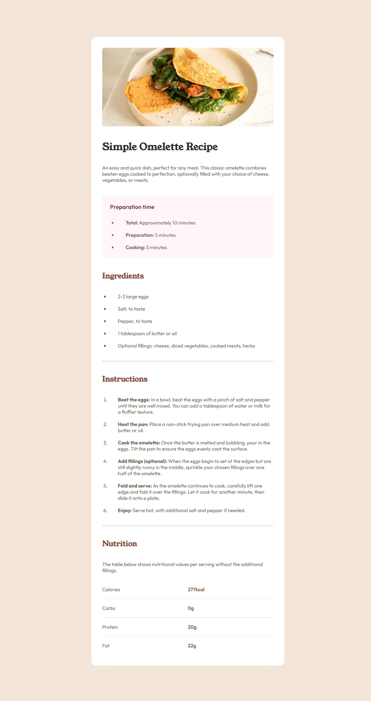
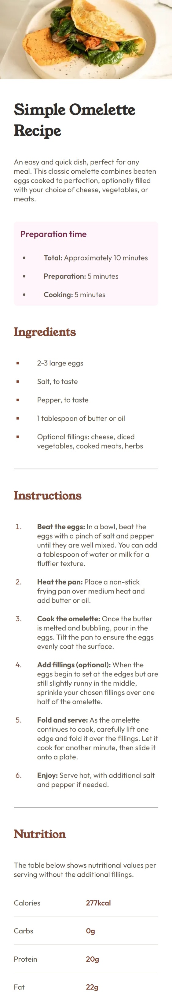

# Frontend Mentor - Recipe page solution

This is a solution to the [Recipe page challenge on Frontend Mentor](https://www.frontendmentor.io/challenges/recipe-page-KiTsR8QQKm). Frontend Mentor challenges help you improve your coding skills by building realistic projects.

## Table of contents

- [Overview](#overview)
  - [Screenshot](#screenshot)
  - [Links](#links)
- [My process](#my-process)
  - [Built with](#built-with)
  - [What I learned](#what-i-learned)
  - [Continued development](#continued-development)
- [Author](#author)

## Overview

### Screenshots

- 
- 

### Links

- Solution URL: [Omlette Recipe](https://niloydas07.github.io/RecipePage/)

## My process

### Built with

- Semantic HTML5 markup
- CSS custom properties
- Flexbox
- CSS Grid
- Mobile-first workflow

### What I learned

I learnt how to style borders between the grid elements.

```
  .nutrition-table {
    background-color: var(--Light-Grey);
    display: grid;
    grid-template-columns: 1fr 1fr;
    row-gap: 1px;
    line-height: 60px;
  }

  .nutrition-table p {
    background-color: white;
  }
```

Also I tried to optimize image load time by using a smaller image depending on the device size.

```
  <picture>
    <source
      media="(min-width: 1025px)"
      srcset="./assets/images/image-omelette.webp"
    />
    <source
      media="(max-width: 1024px)"
      srcset="./assets/images/image-omelette-1024.webp"
    />
    
  </picture>

### Continued development

I need a bit more practise with CSS Grid.

## Author

- Frontend Mentor - [@NiloyDas07](https://www.frontendmentor.io/profile/NiloyDas07)
```
